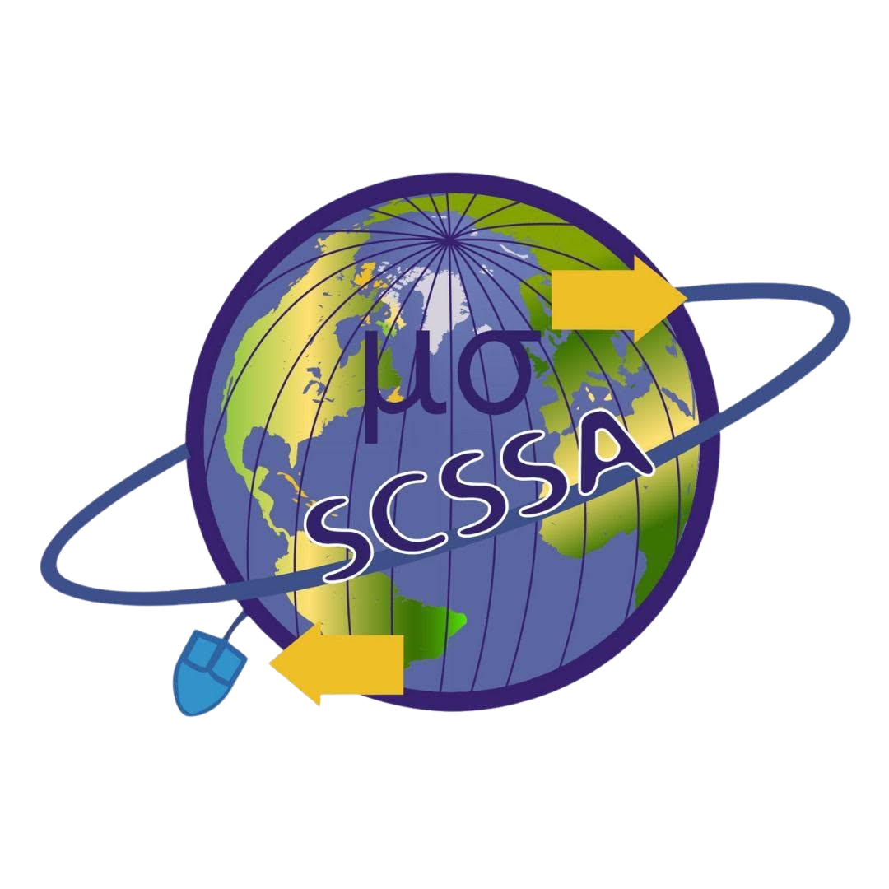

  

  <h1>🎓 Welcome to our GitHub Hub!</h1>
  
<strong>Department of Statistics & Computer Science • University of Kelaniya</strong>

  
  

    
    
    
  

---

## 🌟 About Us

Welcome to the official GitHub organization for the **Department of Statistics & Computer Science**, University of Kelaniya! This is the central hub where our brilliant students collaborate, build, and showcase their academic and extracurricular tech projects.

From fundamental coursework assignments to groundbreaking Final Year Projects, this space is dedicated to fostering innovation, open-source contribution, and teamwork.

---

## 🚀 Need a Repository for Your Project?

Are you a student starting a new coursework or degree project? You can request an official, private GitHub repository here within seconds.

   
  
    

### What we host:

- 💻 **Coursework (`co2060`)** - Foundation and core programming projects.
- 🛠️ **3rd Year Projects (`3yp`)** - Advanced group projects and real-world software engineering.
- 🎓 **Final Year Projects (`4yp`)** - Research and enterprise-grade system development.

---

## 📈 Tech Stack & Languages

Our students work with a diverse set of modern technologies to build their solutions:

  

---

## 🏆 Top Repositories & Resources

- 📌 **[Project Requests](https://github.com/SCSSA-UoK/project-requests)** - The automated portal to request your project workspace.
- _More featured projects from our students will be showcased here soon!_

---

## 📞 Get in Touch

We're always open to collaboration, industry partnerships, and academic inquiries.

- 📍 **Address:** Faculty of Science, University of Kelaniya, Dalugama, Kelaniya, Sri Lanka.
- 📧 **Email:** [dscs@kln.ac.lk](mailto:dscs@kln.ac.lk)
- 📞 **Phone:** +94 (0)11 2908780 / +94 (0)11 2903371

   
  <i>Empowering the next generation of tech innovators.</i>
   
  <b>University of Kelaniya</b>

